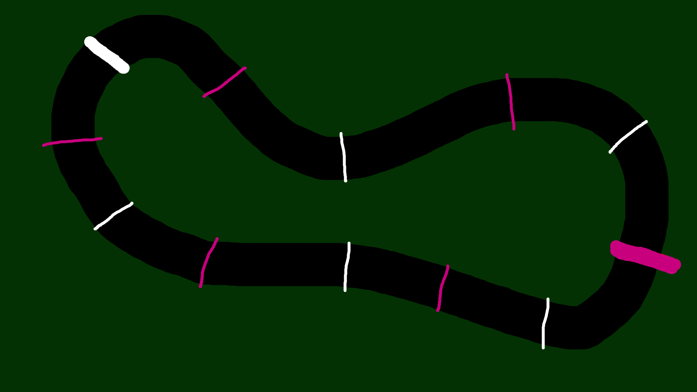

# **Systemy inteligentne - raport końcowy**

## Temat projektu: Tor samochodowy - uczenie ze wspomaganiem

| Indeks | 260338 | 262799 |
|:---:|:---:|:---:|
| Grupa | Adam Bednarski | Paweł Lachawiec |

## Agenda:
1.  Wstęp
    1. Temat projektu
    2. Środowisko pracy i stosowane narzędzia 
2. Charakterystyka projektu
3. Opracowany model
4. Implementacja modelu
5. Wyniki modelu
6. Dodatkowe informacje

## 1. Wstęp

### 1. Temat pracy
Spośród kilku zaproponowanych ścieżek projektu zdecydowaliśmy się na realizację projektu dotyczącego uczenia ze wspomaganiem.
W ogólności postanowiliśmy zaimplementować narzędzie symulacji poruszania się pojazdu po torze z wykorzystaniem uczenia maszynowego.

### 2. Środowisko pracy i stosowane narzędzia
Projekt został zaimplementowany w języku JavaScript, w szczególności poprzez wykorzystanie biblioteki <i>.p5</i> dla JavaScript. Dzięki temu mogliśmy poświęcić wystarczającą ilość czasu na opracowanie modelu uczącego, a do implementacji środowiska webowego użyliśmy m.in. dodatkowych funkcji z w/w biblioteki. 
Do zaimplementowania modelu uczenia ze wspomaganiem wykorzystaliśmy paczkę <i>ReImprove</i> opartą na platformie <i>TensorFlow.js</i>.

## 2. Charakterystyka projektu
### 1. Opracowanie środowiska do rysowania torów
Nasze narzędzie symulacyjne umożliwia tworzenie dowolnych torów jazdy poprzez wcięnięcie przycisku <i>Create Track!</i>. Procedura tworzenia sprowadza się do: 
1. narysowania dowolnego kształtu w kolorze czarnym będącym torem jazdy (wyboru koloru można dokonać poprzez wybranie go z dostępnej palety kolorów w prawym górnym rogu)
2. Narysowania linii mety w kolorze białym lub różowym (musi się ona znajdować w obrębie narysowanego czarnego kształtu). Punkt startowy dla pojazdu jest określony z góry w miejscu napisu `Start`, więc należy tak narysować kształt, by miejsce startowe znajdowało się w jego obrębie. Przejeżdzając przez nie pojazd otrzymuje punkty, których licznik widnieje na środku ekranu.
4. Narysowania dowolnej liczby punktów kontrolnych w postaci linii o kolorze jasnozielonym, za których przekroczenie pojazd będzie nagradzany w procesie uczenia.Wielkość pędzla do rysowania można zmieniać za pomocą klawiszy `u` oraz `j`. Po skończeniu rysowania toru należy wcisnąć przycisk `Save!` aby rozpocząć symulację. 
 
<i>Rys.1 Przykład toru jazdy utworzonego przez użytkownika </i>  

### 2. Zaprojektowanie pojazdu
Rozmiar oraz wygląd pojazdu jest ustalony z góry, aby uniemożliwić sytuację, w której pojazd byłby większy od szerokości toru (przy tworzeniu toru jest ustawiona minimalna grubość pędzla do rysowania).  

 
<i>Rys.2 Model pojazdu </i>  

### 3. Cel pojazdu
Celem pojazdu jest przejechanie po utworzonym dla niego torze, bez wyjechania poza jego granice. Granice toru mieszczą się na granicy narysowanego kształtu, a więc w granicach koloru czarnego. (patrz: Rys.1). Gdy pojazd wyjedzie poza tor, przejazd jest kończony, na liczniku śmierci pośrodku ekranu dodawana jest kolejna śmierć, a przejazd jest wznawiany automatycznie z linii startu. Szczegóły opracowanego modelu znajdują się w osobnym punkcie raportu. (patrz: Opracowany model).

## 3. Opracowany model
Rozpatrujemy ruch dwuwymiarowy na płaszczyźnie pionowej, przy użyciu układu współrzędnych $O_{xy}$.  

**Położenie:**
Położenie punktu materialnego jest reprezentowane przez dwie wspłrzędne wektora położenia: x oraz y. Można to w skrócie zapisać jako równość: $r = (x, y)$.   

**Prędkość:**
Wektor prędkości jest złożeniem prędkości w kierunku "poziomym" i "pionowym": $V = (V_x, V_y)$. Prędkości w kierunkach osi wspórzłdnych określa się jak w ruchu prostoliniowym. 

**Przyspieszenie:**
W ruchu na płaszczyźnie przyspieszenie jest wektorem zdefiniowanym jako $a=\Delta V / \Delta t$. Przyrost $\Delta V$ należy rozumieć jako różnicę dwóch wektorów prędkości  $V_2$  i  $V_1$ , odpowiadających odpowiednio chwilom $t$ + $\Delta t$ oraz t. $\Delta V = V_2 - V_1$

Zmiana prędkości następuje na dwa sposoby: albo przez zmianę wartości samej prędkości (damping (tłumienie): $V_x=V_x/F_{damp}, V_y=V_y/F_{damp}$, gdzie $F_{damp}=1.07$ - współczynnik tłumienia), albo przez zmianę jej kierunku (lub też na oba te sposoby jednocześnie).

Jako że nasz pojazd nie porusza się po prostym torze, a po torze o dowolnym kształcie, do opisania kierunku poruszania się pojazdu należało wprowadzić kąt obrotu pojazdu $\alpha$, dla którego następuje zmodyfikowanie reprezentacji wektora położenia.  
Położenie poziome zmienia się w czasie według wzoru:   
$x = x_0 + v_{x}t \cos(\alpha)$, gdzie $v_{x}=v_{0x}*a_{x}$  
Położenie pionowe podlega prawu:  
$y = y_0 + v_{y}t \sin(\alpha)$, gdzie $v_{y}=v_{0y}*a_{y}$  
Wartości początkowe dla modelu pojazdu:  
$\alpha=290$  
$V_x=0$  
$V_y=0$  
$a_x=0$  
$a_y=0$  

**Model uczący**

Do implementacji naszego modelu uczącego używamy biblioteki ReimproveJS, czyli frameworka przeznaczonego do głębokiego uczenia ze wspomaganiem dla języka JavaSript. Uczenie opiera się na algorytmie DQN, a obliczenia wykonują się z wykorzystaniem WebGL. 

Korzystając z nomenklatury użytej bezpośrednio w dokumentacji biblioteki, koncept modelu jest następujący:
Tworzymy środowisko zorganizowane na wzór szkoły, w której nauczyciel uczy swojego ucznia. W szczególności: zarządzamy <i>Akademię</i>, posiadającą swojego <i>nauczyciela</i> oraz przypisanego do niego <i>ucznia</i>. Z każdą iteracją emulacji Akademia otrzymuje wejście od nauczyciela, który zajmuje się uczeniem swoich studentów. Do uczenia się studentów wykorzystywana jest konwulsyjna sieć neuronowa (w przeciwieństwie do klasycznych algorytmów DQN wykorzystujących DNN).
Jako parametry naszego modelu uczącego przyjęliśmy: 
1. Liczba epok: 1
2. Liczba kroków w epoce: 60
3. Liczba wejść sieci neuronowej: 7 (pozycja pojazdu: $x$, pozycja pojazdu $y$, prędkość pojazdu  $V_x$, prędkość pojazdu  $V_y$, 3 promienie odległości od granicy toru)
4. Liczba warstw ukrytych sieci neuronowej: 1
5. Liczba neuronów w warstwie ukrytej: 32
6. Liczba neuronów w warstwie wyjściowej: 3 (liczba akcji, które może podjąć student: ruch do przodu - 0, ruch w lewo - 1, ruch w prawo - 2 )
7. Funkcja aktywacji neuronów w warstwie ukrytej: relu
8. Funkcja aktywacji neuronów w warstwie wyjściowej: softmax

Jako parametry naszego nauczyciela przyjęliśmy:
1. Liczba lekcji: 100000
2. Długość lekcji (liczba kroków symulacji na jedną lekcję): 300
3. Liczba lekcji losowych: 5 (pozwalająca wyjść z ekstremum lokalnego w przypadku utknięcia modelu)
  Oraz wartości parametrów Q-learningu: 
    1. Rozkład epsilon: (wspóczynnik losowości, by nie utknąć w ekstremum lokalnym): 0.995
    2. Minimalna wartość epsilon: (jako że wspóczynnik maleje z każdą iteracją, to ustalamy jego minimalną wartość): 0.05
    2. Gamma: (czynnik dyskontowy, czyli jak szybko chcemy osiągnąć cel): 0.8

Oraz parametry uczenia:
1. goodEventReward - wspóczynnik nagrody
2. badEventReward - wspóczynnik kary

Funkcje nagród oraz kar:
1. Funkcje kar:
* na podstawie wykrywania granicy toru: gdy odległość od aktualnego położenia pojazdu do granicy toru będzie mniejsza niż 50 pikseli  wówczas przydzielana będzie kara dla <i>studenta</i> o wartości 0.2 co każdy krok symulacji działania symulacji. 
* na podstawie analizy miejsca poprzedniej śmierci: jeśli pojazd wyjedzie poza tor w miejscu oddalonym o mniej niż 50 pikseli w stosunku do miejsca jego śmierci w poprzedniej iteracji symulacji zostanie przydzielona kara o wartości -10.
2. Funkcje nagród:
* algorytm LineIntersection dla przejazdu przez punkty kontrolne: aby wykryć kiedy pojazd znajdzie się na przecięciu z linią punktu konmtrolnego używamy zaimplementowanego przez nas algorytmu LineIntersection:  
$d=(y_4-y_3)*(x_2-x_1)-(x_4-x_3)*(y_2-y_1)$  
$A=(x_4 - x_3) * (y_1 - y_3) - (y_4 - y_3) * (x_1 - x_3)$  
$B = (x_2 - x_1) * (y_1 - y_3) - (y_2 - y_1) * (x_1 - x_3)$  
Jeżeli $|A=0|$ oraz $|B=0|=0$ oraz $|d|=0$ to punkt przecięcia to $(intx, inty)$, gdzie $intx = (x_1+x_2)/2 $ oraz $inty=(y_1 + y_2) / 2$. Współrzędne te muszą się pokryć ze współrzędnymi $(x,y)$ pojazdu, aby została przyznana nagroda o wartości: 5 - dla różowych/białych punktów kontrolnych, 1 - dla jasnozielonych.
* na postawie wykrywania granicy toru: gdy odległość od aktualnego położenia pojazdu do granicy toru będzie większa niż 50 pikseli  wówczas przydzielana będzie nagroda dla <i>studenta</i> o wartości 0.1 co każdy krok symulacji działania symulacji.
* na podstawie czasu utrzymania się na torze: co każdy krok symulacji działania symulacji zostaje przyznawana nagroda o wartości 0.001 w przypadku gdy pojazd znajduje się w obrębie narysowanego toru
* na podstawie prędkości pojazdu: co każdy krok symulacji działania symulacji pojazdowi przyznawana jest nagroda proporcjonalna do jego aktualnej prędkości. Nagroda wynosi $(|V_x+V_y| - 2.5) * 0.01$.
## 4. Implementacja modelu
Cały projekt znajduje się na repozytorium Github: https://github.com/Famidore/geneticDriver, 
a narzędzie można uruchomić samodzielnie tutaj: https://famidore.github.io/geneticDriver/. 

## 5. Wyniki modelu
Aby obiektywnie ocenić działanie naszego modelu przeprowadziliśmy badania symulacyjne: 
Przeprowadziliśmy łącznie 30 symulacji na modelu z wyżej wymienionymi parametrami symulacji (wcześniej testowaliśmy różne konfiguracje parametrów sieci neuronowej, parametrów Q learningu, a także różne funkcje kar i nagród, ostatecznie decydując się na parametry opisane w punkcie <i>Model uczący</i>). Warunkiem końcowym symulacji było 7000 iteracji (7000 śmierci pojazdu). Jako że sam czas pojedynczej symulacji nie byłby miarodajny, postanowiliśmy śledzić liczbę punktów uzyskanych przez pojazd w każdej iteracji, następnie licząc jej średnią dla całej symulacji. Dla naszego badania wyniosła ona średnio 22.38. 
 
Wniosek z badań symulacyjnych: dużą rolę odgrywa losowość: dla niektórych symulacji pojazd był w stanie przejechać przez znaczącą część toru już we wczesnych iteracjach jego nauki, a w niektórych osiągał ekstremum lokalne całkiem blisko startu. Przykładowe symulacje są umieszczone na repozytorium GitHuba w formie nagrań. Niemniej jednak na przestrzeni całej symulacji można zauważyć proces uczenia się pojazdu, który rzeczywiście pokonuje coraz większą odległość w miarę procesu uczenia się. Dodatkowym ważnym składnikiem dla nauki modelu było rozmieszczenie oraz ilość promieni zwracających <i>studentowi</i> odległość od krańców toru; przy umożliwieniu studentowi "widzenia" do tyłu starał się on przeżyć jak najdłużej poprzez kręcenie się w kółku na szerszym odcinku toru.  Ponadto, w przypadku braku kary lub nagrody za zachowywanie odpowiedniej odległości od krańców toru student przejeżdzał przez tor trzymając się jak najbliżej granicy toru, jednocześnie jej nie przekraczając. 

## 6. Dodatkowe informacje
Dodatkowo w naszym modelu umożliwiliśmy ręczne sterowanie pojazdem za pomocą klawiszy <i>w,a,s,d</i>.
Za pomocą klawisza <i>r</i> możemy przywrócić pojazd do jego pozycji startowej.
